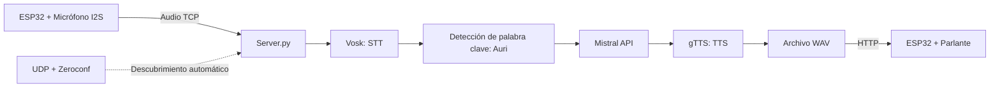

# Auri - Asistente de voz con IA (Python + ESP32)

### ¿Qué es Auri?

**Auri** fue mi proyecto final de segundo de bachillerato en la **Escuela Técnica El Pinar (UTU)**. Es un asistente virtual diseñado para interactuar mediante voz y funcionar tanto en computadora como en un sistema físico basado en ESP32.

### Video demostrativo: 
https://github.com/user-attachments/assets/17aaace7-e226-4a94-91dd-c7959dbb14ec

### ¿Cómo usar Auri.exe?
1. Asegurarse de tener un micrófono y parlante predeterminado en la computadora.
2. Descargar y abrir [**Auri.exe**](https://github.com/Maypoo/Auri/releases/download/v1.0.0/Auri.exe)
3. Decir "Auri" y esperar el sonido de activación.
4. Realizar cualquier consulta.

### Características

- Activación por palabra clave "Auri".
- Reconocimiento de voz con Vosk.
- Generación de respuestas con Mistral AI.
- Texto a voz con gTTS.
- Versión de escritorio compilada con PyInstaller.
- Sistema físico basado en ESP32.

### Tecnologías que usé

- Lenguaje: Python
- IA y voz: Mistral AI, Vosk, gTTS
- Audio: Sounddevice, Pygame
- Hardware: ESP32
- Redes: TCP, UDP, HTTP, Zeroconf
- Distribución: PyInstaller

El proyecto se estructuró en dos aplicaciones principales:

### Auri.py (versión de escritorio)
Es una versión de escritorio diseñada para ejecutarse directamente en una computadora. Esta versión tiene captura de audio, procesamiento y reproducción de respuestas en un único entorno, usé librerías como Vosk para reconocimiento de voz, gTTS para síntesis de audio y la API de Mistral para la generación de respuestas mediante un agente personalizado usando inteligencia artificial. También usé sounddevice para la entrada de audio y pygame para la salida.

### Server.py (sistema para ESP32)
Fue desarrollado para un sistema físico usando ESP32. En este sistema el ESP32 actúa como cliente capturando audio mediante un micrófono I2S y enviándolo a Server.py a través de una conexión TCP. El servidor procesa el audio detectando palabras clave, este hace una consulta a Mistral y genera una respuesta con el mismo sistema que Auri.py, luego esta respuesta se envía nuevamente al dispositivo en forma de audio y se reproduce mediante un parlante.

### Diagrama de flujo

Para la comunicación entre el ESP32 y el servidor usé TCP para streaming en tiempo real de audio, UDP para descubrimiento automático del servidor en la red local, y HTTP para la distribución de archivos de audio en formato WAV. Además usé Zeroconf (mDNS) para facilitar la detección del servicio sin configuración manual de IPs.

El sistema final tenía procesamiento de audio en tiempo real y control de estados de interacción mediante señales de audio (sonidos de activación y finalización).

Como parte de la distribución del proyecto, la versión de escritorio (Auri.py) la compilé en un archivo ejecutable (.exe) usando PyInstaller el cual se puede usar hoy en día. Esto permite su uso en cualquier computadora de manera intuitiva sin necesidad de instalar dependencias adicionales.

### Desarrollo de todo el proyecto: 
~6 meses
